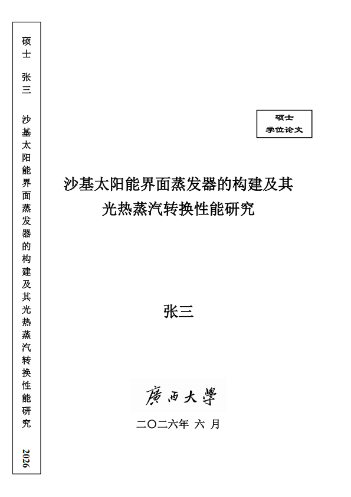

# 广西大学学位论文 LaTeX 模板

本模板依据广西大学学位论文格式规范制作，基于 TeX Live 2025（最低测试至 TeX Live 2023），支持**博士/硕士**学位论文排版。

## 使用要求

- **编译器**：XeLaTeX
- **参考文献后端**：Biber
- **TeX 发行版**：TeX Live 2023 或更高版本

## 快速开始

1. 下载或克隆本仓库
2. 将中易系列字体文件放入 `字体/` 文件夹（详见下方字体说明）
3. 用编辑器打开 `main.tex`，按需填写论文信息
4. 编译顺序：`XeLaTeX → Biber → XeLaTeX → XeLaTeX`

## 字体说明

本模板使用中易系列字体，均为微软公司商业字体，受版权保护，**请勿将字体文件用于商业用途，亦请勿将其上传至公开网络**。

| 字体 | 文件名 |
|------|--------|
| 中易宋体 | `simsun.ttc` 或 `simsun.ttf` |
| 中易黑体 | `simhei.ttf` |
| 中易隶书 | `simli.ttf` |

- **Windows 用户**：字体通常已随系统预装，模板将自动识别，无需额外操作。
- **macOS / Linux 用户 / 在线平台用户**：请自行获取字体文件，按上表命名后放入项目根目录下的 `字体/` 文件夹。文件名及扩展名须**全部小写**。
- 若字体均无法获取，模板将自动回退至系统默认字体，仍可正常编译，但排版效果可能与预期有所差异。

## 主要功能

- 与 2026 年模板的要求已做到完全一致
- 封面、扉页、声明页自动生成，支持盲审模式
- 支持 GB/T 7714—2015 与 GB/T 7714—2025 两种参考文献标准（切换方式见模板说明章节）
- 支持书脊单列/双列排版
- 支持专业学位论文
- 预定义五至七级标题列表样式
- 插图清单、附表清单、缩略语清单、符号清单、术语表、索引
- 数学排版基于 `unicode-math`，兼容常用 `amsmath` 命令

## 关于本模板

本模板在广西大学物理学院 2021 级硕士**王信哲（KingwithQueen）**开发的 [GXU-Masters-and-PhD-Thesis-Templates](https://github.com/KingwithQueen/GXU-Masters-and-PhD-Thesis-Templates) 基础上进行了大量修改与重构。若原作者认为本模板侵犯了其权益，请联系作者，将立即处理。

模板中使用的广西大学题字图片提取自广西大学官方发布的 Word 学位论文模板，仅供本模板排版使用，**严禁用于其他任何用途**。作者无意侵犯广西大学的任何权益，若校方认为此使用方式不当，请联系作者处理。

本模板作者并非广西大学在读或毕业学生，与广西大学不存在任何隶属关系。**本模板在发布后将不再主动维护。** 欢迎有意愿的同学或开发者继续维护与更新，更新时请在显著位置保留对原作者的署名。

### 关于 biblatex-gb7714-2015 宏包

本模板在选用 GB/T 7714—2025 样式时，附带了 `biblatex-gb7714-2015` 宏包的最新版本（GB/T 7714—2025 样式已作为该宏包的组成部分发布至 CTAN）。附带此文件的原因是 TeX Live 收录版本可能滞后于 CTAN 最新发布，旧版本存在已知缺陷。**宏包的著作权归原作者 [hushidong](https://github.com/hushidong) 所有**，本模板未对其作任何修改。待 TeX Live 同步更新后，可直接删除本模板附带的宏包文件，改用系统版本。

## 联系方式

- **邮箱**：请在 GitHub 个人主页查看
- **GitHub Issues**：[提交问题](https://github.com/SchrodingerBlume/gxuthesis/issues)

## 许可证

本模板以 [LaTeX Project Public License 1.3c](https://www.latex-project.org/lppl/) 发布。

字体文件及广西大学题字图片不在此许可证的覆盖范围内，版权归各自权利人所有。
